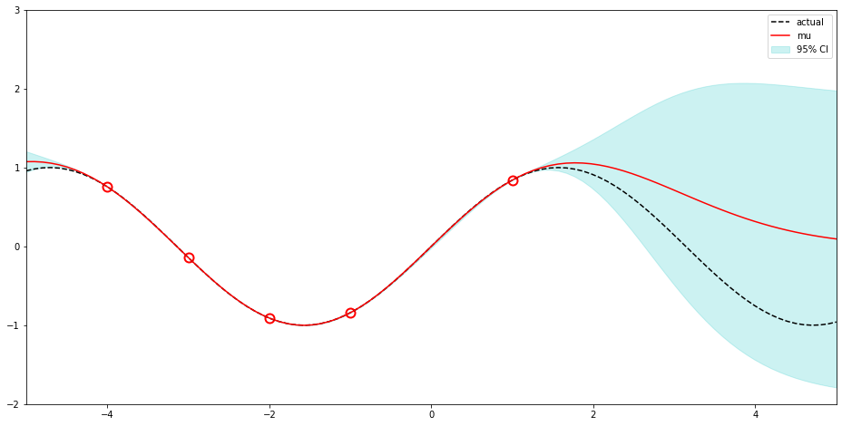

# GPyBO

[](https://travis-ci.org/danielkelshaw/GPyBO)

Gaussian Processes | Bayesian Optimisation

- [x] MIT License
- [x] Python 3.6+

### **Gaussian Process Regression in 7 Lines:**

```python
import numpy as np
from gpybo import GP, SquaredExponentialKernel

x = np.array([-4, -3, -2, -1, 1])
y = np.sin(x)

gp = GP(SquaredExponentialKernel()) | (x, y)
gp.train(n_restarts=10)

mv_norm = gp(np.linspace(-5, 5, 100))
```



### **GP Representation:**

```python
>>> GP(SquaredExponentialKernel(l=2.5, sigma=0.1))
GP(ZeroMean(), SquaredExponentialKernel(l=2.500, sigma=0.100))
```

### **Kernel Composition:**
The provided kernels can be combined in a number of ways in order to increase
the complexity of the kernel composition. Representations of these combination
kernels have been optimised to ensure they are concise - any relevant parameters
are also shown. 

**Addition + Subtraction:**

```python
>>> SquaredExponentialKernel() + Matern32Kernel()
SquaredExponentialKernel(l=1.000, sigma=1.000) + Matern32Kernel()

>>> OneKernel() - SincKernel()
OneKernel() - SincKernel()
```

**Multiplication:**

```python
>>> SquaredExponentialKernel() * Matern32Kernel()
SquaredExponentialKernel()Matern32Kernel()

>>> 3.0 * Matern52Kernel()
3.0Matern52Kernel()

>>> OneKernel() - 2.0 * (SquaredExponentialKernel() * SincKernel())
OneKernel() - 2.0SquaredExponentialKernel()SincKernel()

>>> (SquaredExponentialKernel() + SincKernel()) * (Matern32Kernel() + Matern52Kernel())
[SquaredExponentialKernel(l=1.000, sigma=1.000) + SincKernel()][Matern32Kernel() + Matern52Kernel()]
```

###### Made by Daniel Kelshaw
